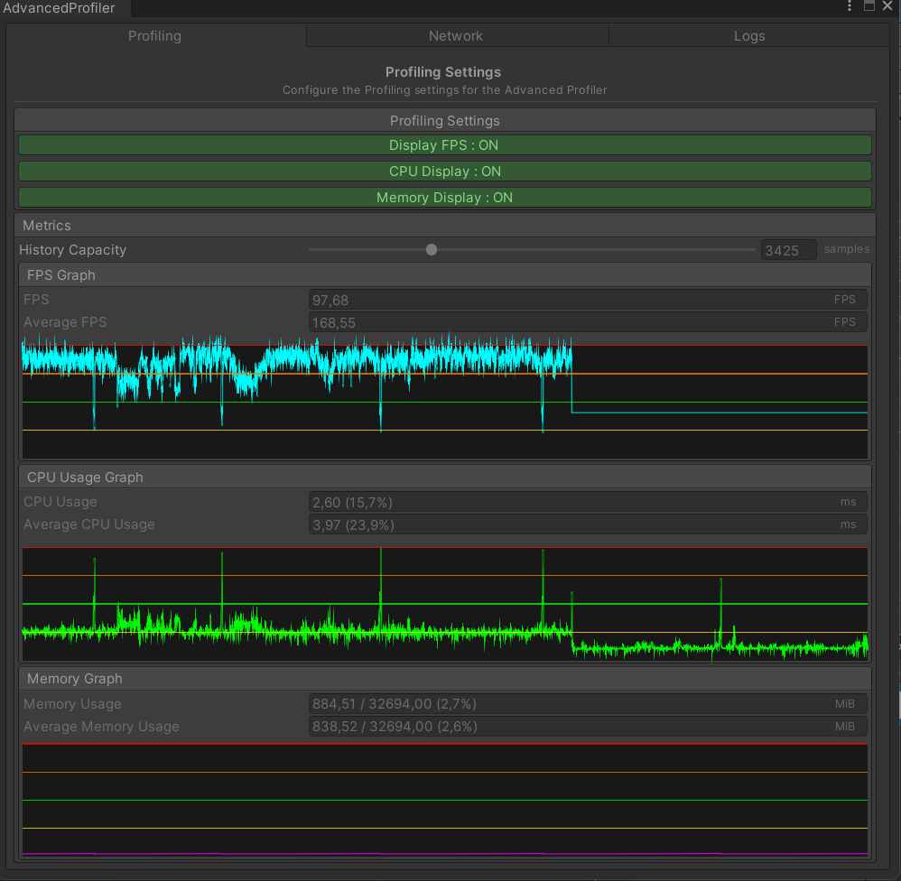

# Advanced Unity Profiler
##  — with Odin Inspector
### *Caution: WIP*

This is a simple Unity project that shows how to use Odin Inspector to create a custom editor for the Unity Profiler.
The Unity Profiler is a powerful tool that allows you to profile your game
and see where the performance bottlenecks are.
However, the default interface can be a bit overwhelming, especially for beginners.
This project shows
how you can use Odin Inspector to create a custom editor that makes it easier to understand and analyze the data.

### Features
- Custom editor for the Unity Profiler
- Displays the most important information in a clear and concise way
- It Allows you to filter and sort the data to focus on specific areas of interest
- Makes it easier to identify performance bottlenecks and optimize your game

### How to use
1. Clone the repository or download the zip file.
2. Open the project in Unity.
3. Open the `AdvancedProfiler` scene.
4. Under the `Tools` menu, select `AdvancedProfiler` to open the custom editor.
5. Choose the Profiler module you want to analyze (CPU, GPU, Memory, etc.).
6. Enjoy!

### Screenshots

### Notes
- It was built using Unity 6000 and Odin Inspector 3.3.1.11

### Future improvements
- Add more features and options to the profiler like custom filters, graphs, etc.
- Add NGO Multiplayer analytics support for multiplayer games
- Add Log Viewer for easier debugging
- Add support for other profiling tools like RenderDoc, etc.
- Create an Asset package for easy integration into other projects

### License
This project is licensed under the MIT License - see the [LICENSE.md](LICENSE.md) file for details.

### Acknowledgments
- Odin Inspector by Sirenix 
- Unity Profiler by Unity Technologies
- Unity Engine by Unity Technologies

### Contact
If you have any questions or suggestions,
feel free to contact me at [https://goldbarth.github.io/Portfolio/](https://goldbarth.github.io/Portfolio/)